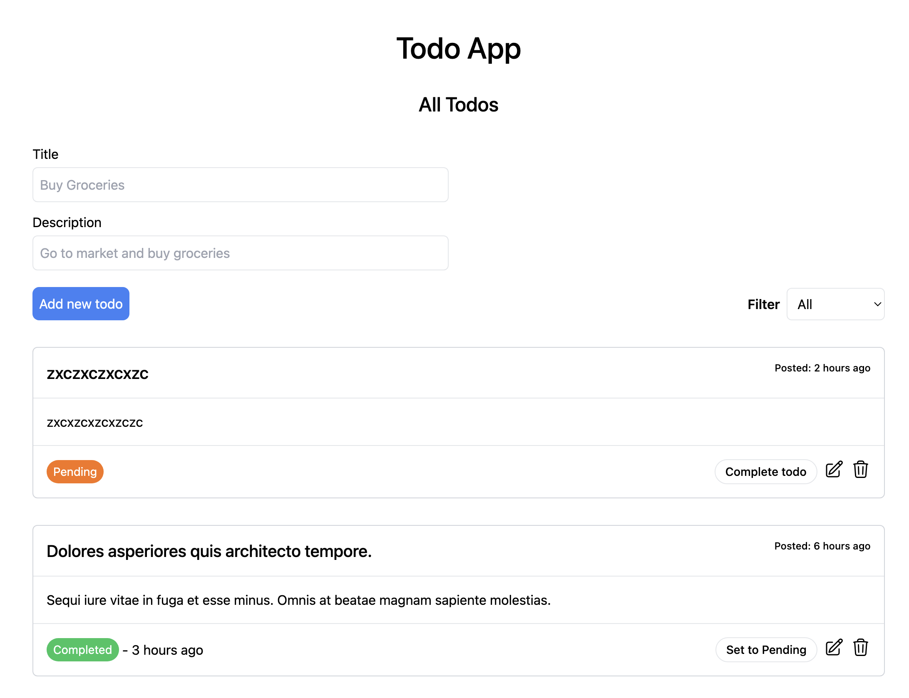
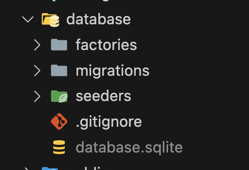
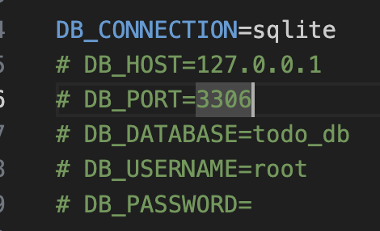

**TODO TEST APP - Laravel and Vue3**

FRONTEND

- npm install
- npm run dev

BACKEND

- create a database MySQL or SQLITE
- open .env file and configure database settings

  example

  

if you are using SQLite all you have to do is comment out everything except DB_CONNECTION, you need to create a database file in database folder in your laravel root directory

- run command php artisan migrate, for database migration
- run command php artisan db:seed, to generate dummy data in the todos table
- lastly run command, php artisan serve
